# Little Lemon Database Capstone Project

## Introduction
This project is helps Little Lemon build and management. To accomplish this, the following tasks were performed:

## Task-1 Build Little Lemon Database Management System
### 1. Choosing the right Data Model
After comparing various data models, the entity relationship model is the best fit for Little Lemon data requirments.This model present each table as an entity with a set of attribules in a ER diagram. Based on Little Lemon business structure, the following entitities and attributes were identified. 

#### Little Lemon Entities with related attributes 
1. Customer - [CustomerID, FirstName, LastName, Email, PhoneNumber]
2. Orders   - [OrderID, BookingID, CustomerID, MenuID, Quantity, TotalCost]
3. Bookings - [BookingID, TableNo, CustomerID, BookingSlot, EmployeeID]
4. Menu - [MenuID, ItemID, Name, MenuType]
5. MenuItem - [ItemID, Name, Type, Price]
6. Employee - [EmployeeID, FirstName, LastName, Role, Salary]         

### 2.Creating the ER-Diagram in MySQL workbench 
MySQL workbench was used to create a normalized entity relationship model or ER diagram for the Little Lemon database management system. The diagram show all entities or tables along with their related attributes, constraints, primary keys and secondary keys.The diagram show a one-to-many relationship between entities. Finally diagram also show that the database adheres to the 3 fundamental normal forms 1NF, 2NF and 3NF. 

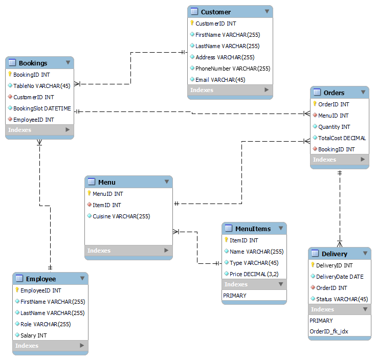

### 3. Implementing the Little Lemon database Schema
The MySQL workbench forward engineering feature was then used to implement the Little Lemom database model into the MySQL server. schema.  
## Task-2 Create Sales Report from Little Lemon data

### 1. Create Virtual Table to summarize data
The image below is a virtual table called OrdersView that focuses on OrderID, Quantity and Cost columns within the Orders table for all orders with a quantity greater than 2. 

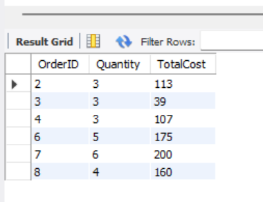

### 2. Join query statement for multiple tables 
The query statement below collect information from four tables on all customers with orders that cost more than $150. Extract the required information from each of the following tables by using the relevant JOIN clause: 
[Little Lemon Join Query SQL Statment](LittleLemon_Join_Tables_Queries/LittleLemon_JoinQuery_DataSummarization.sql)

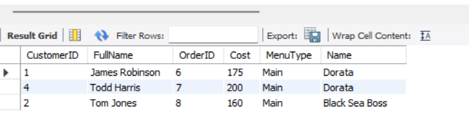

### 3. Data summarization using Subquery statement 

Little Lemon need to find all menu items for which more than 2 orders have been placed. You can carry out this task by creating a subquery that lists the menu names from the menus table for any order quantity with more than 2. This was accomplish using the following SQL statement. 

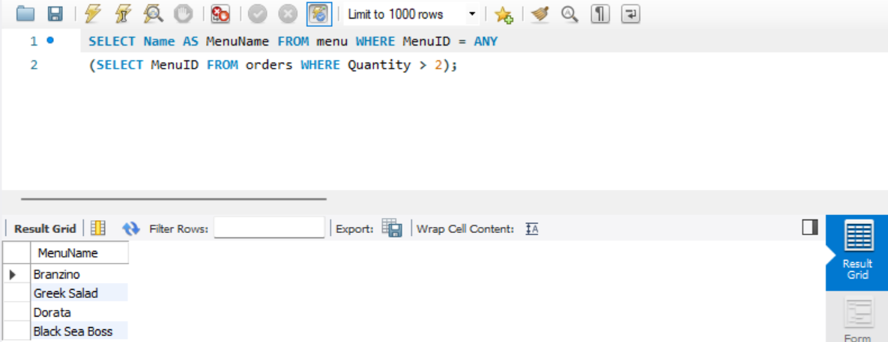

## Task-3 Create optimized queries to manage and analyze data

### 1. Stored Procedure- GetMaxQuantity
In this first task, Little Lemon need you to create a procedure that displays the maximum ordered quantity in the Orders table.

#### SQL Statement:
#####  CREATE DEFINER=`sbishop`@`%` PROCEDURE `GetMaxQuantity`() 
##### BEGIN 
##### SELECT max(Quantity) as MaxQuantityOrdered FROM orders;
##### END 

#### Query Result:
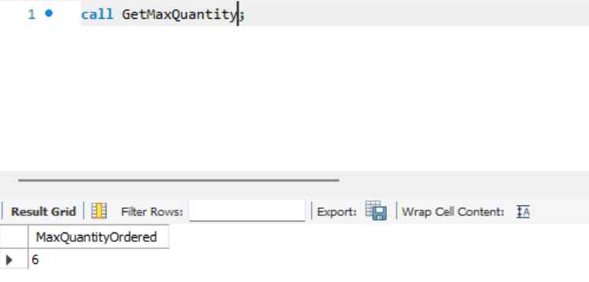

In this first task, Little Lemon need you to create a procedure that displays the maximum ordered quantity in the Orders table.

### 2. Prepared Statement- GetOrderDetail

In the second task, Little Lemon need you to help them to create a prepared statement called GetOrderDetail. This prepared statement will help to reduce the parsing time of queries. It will also help to secure the database from SQL injections.

#### SQL Statement:
###### PREPARE GetOrderDetail FROM 'SELECT OrderID, Quantity, TotalCost FROM orders WHERE CustomerID = ?';

#### Query Result:

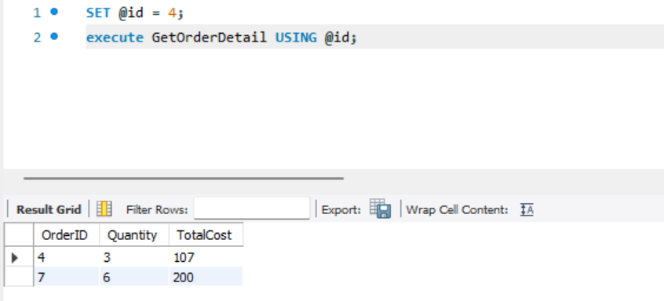

### 3. Stored Procedure- CancelOrder

Your third and final task is to create a stored procedure called CancelOrder. Little Lemon want to use this stored procedure to delete an order record based on the user input of the order id.
Creating this procedure will allow Little Lemon to cancel any order by specifying the order id value in the procedure parameter without typing the entire SQL delete statement.  

#### SQL Statement:
CREATE DEFINER=`sbishop`@`%` PROCEDURE `CancelOrder`(Order_ID Int)
BEGIN
DELETE FROM orders WHERE OrderID = Order_ID;
SELECT CONCAT("Order"," ",Order_ID," ", "is Cancelled") AS Confirmation; 
END

#### Query Result:

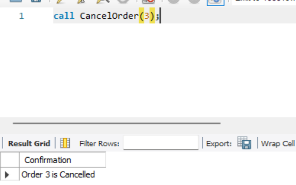

## Task-4 Create SQL queries to check available bookings based on user input

### 1. Populate Booking Table

Little Lemon wants to populate the Bookings table of their database with some records of data.

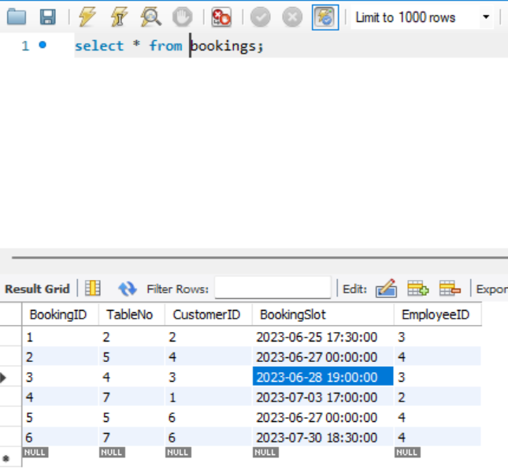

## Task-5 Create Interactive Dashboard for Sales and Profit

### 1. Barchart of Customer Sales 

In the first task, you need to create a bar chart that shows customers sales and filter data based on sales with at least $70.

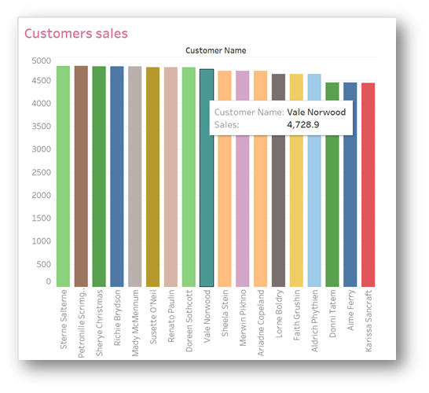

### 2. LineChart of Sales Trend 2019 to 2022 

In the second task, you need to create a line chart to show the sales trend from 2019 to 2022. 

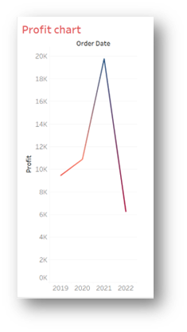

### 3. BubbleChart of Sales for all customers 

In the third task, you need to create a Bubble chart of sales for all customers. The chart should show the names of all customers.

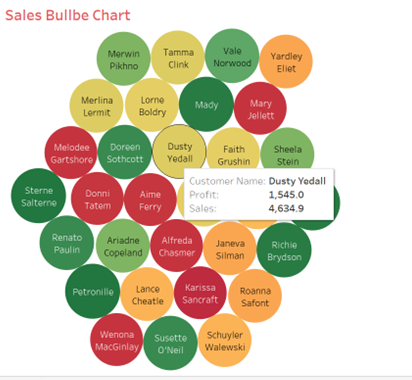

### 4. BarChart of Sales for Turkish Italian and Greek cuisines

In this task, you need to compare the sales of the three different cuisines sold at Little Lemon. Create a Bar chart that shows the sales of the Turkish, Italian and Greek cuisines.You need to display sales data for 2020, 2021, and 2022 only. Each bar should display the profit of each cuisine. 

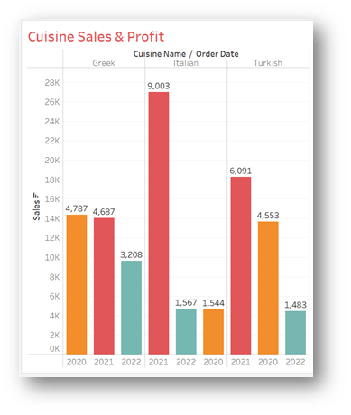

### 5. Little Lemon Interactive Dashboard

In this final task, you need to create an interactive dashboard that combines the Bar chart called Customers sales and the Sales Bubble Chart

